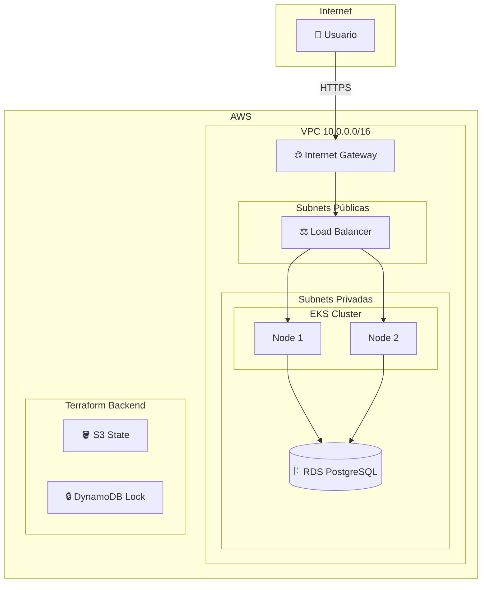

# Proyecto 3 — Terraform Infrastructure as Code

Infraestructura AWS automatizada con Terraform, simulada con LocalStack.  
Forma parte del portfolio DevOps de [Juan Diego Monje](https://monjju.github.io).

## Arquitectura
```
AWS (LocalStack)
├── S3 Bucket          → Remote State
├── DynamoDB           → State Locking
└── VPC (10.0.0.0/16)
    ├── Subnet Pública 1  (10.0.1.0/24) → Load Balancer
    ├── Subnet Pública 2  (10.0.2.0/24) → Load Balancer HA
    ├── Subnet Privada 1  (10.0.3.0/24) → EKS + RDS
    └── Subnet Privada 2  (10.0.4.0/24) → EKS + RDS HA
```

## Stack Tecnológico

| Herramienta | Versión | Uso |
|-------------|---------|-----|
| Terraform | >= 1.5 | IaC |
| AWS Provider | ~> 5.0 | Cloud Provider |
| LocalStack | 2026.3 | Simulación AWS local |

## Estructura
```
proyecto-3-terraform/
├── modules/
│   ├── vpc/        → Red privada, subnets, routing
│   ├── eks/        → Kubernetes gestionado
│   └── rds/        → PostgreSQL gestionado
└── environments/
    └── dev/
        ├── main.tf       → Orquesta los módulos
        ├── backend.tf    → Remote state en S3
        └── provider.tf   → AWS provider
```

## Decisiones de Seguridad

- ✅ EKS endpoint privado — nunca expuesto a internet
- ✅ RDS en subnets privadas — solo accesible desde la VPC
- ✅ Storage encryption habilitado en RDS
- ✅ Security Groups con mínimo privilegio
- ✅ Remote state con locking — seguro para trabajo en equipo

## Prerrequisitos
```bash
brew install terraform awscli localstack/tap/localstack-cli
pip3 install awscli-local --break-system-packages
```

## Uso
```bash
# 1. Arrancar LocalStack
localstack start -d

# 2. Crear backend
awslocal s3 mb s3://terraform-state-dev
awslocal dynamodb create-table \
  --table-name terraform-state-lock \
  --attribute-definitions AttributeName=LockID,AttributeType=S \
  --key-schema AttributeName=LockID,KeyType=HASH \
  --billing-mode PAY_PER_REQUEST \
  --region eu-west-1

# 3. Desplegar
cd environments/dev
terraform init
terraform plan -out=tfplan
terraform apply tfplan

# 4. Destruir
terraform destroy
```

## Módulos

### VPC
Red privada con subnets públicas y privadas en 2 zonas de disponibilidad.
Incluye Internet Gateway y Route Tables.

### EKS *(ready for AWS)*
Cluster Kubernetes con node group autoscalable (min: 1, max: 4).
Control plane privado, workers en subnets privadas.

### RDS *(ready for AWS)*
PostgreSQL 14.7 con cifrado, backups automáticos 7 días y acceso restringido a la VPC.

## Autor

**Juan Diego Monje** — Junior DevOps Engineer  
[GitHub](https://github.com/monjju) · [LinkedIn](https://linkedin.com/in/juan-monje-pulecio) · [Portfolio](https://monjju.github.io)

## Diagrama de Arquitectura

