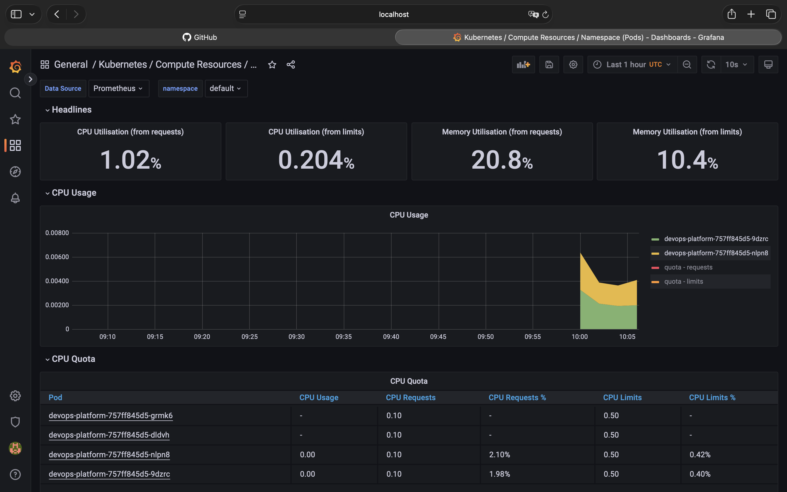
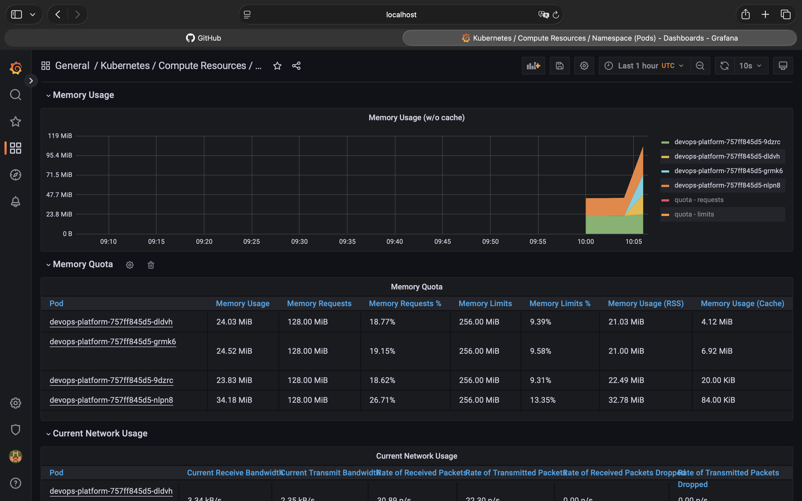
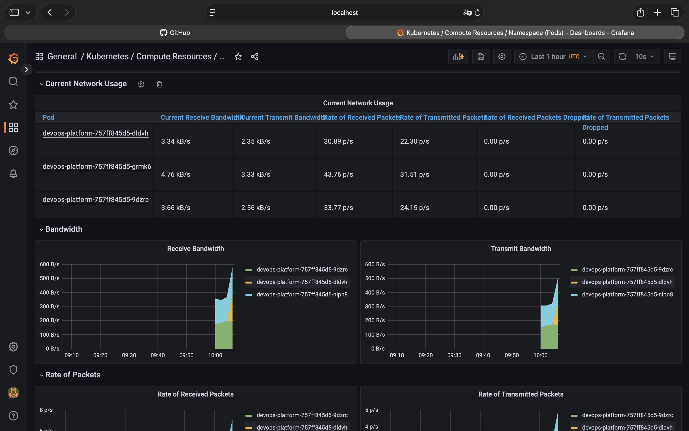

# DevOps Platform  — Mi Primer Proyecto de Portfolio

Hola! Soy Juan Diego, un junior DevOps engineer construyendo mi portfolio desde cero.
Este es mi primer proyecto real — una plataforma Kubernetes completa con observabilidad.
Lo construí para aprender haciendo, no solo siguiendo tutoriales.

## ¿Qué construí?

Una aplicación Python desplegada en Kubernetes con un stack de monitorización completo.
Todo corre en local usando k3d, pero los mismos manifests funcionan en AWS EKS sin cambios.
```
Mi Mac
  └── k3d (Kubernetes local)
        ├── App Python/Flask
        │     └── 3 réplicas con load balancing real
        ├── HPA — escala automáticamente de 2 a 6 pods según CPU
        ├── Ingress — acceso por dominio (devops-platform.local)
        └── Stack de observabilidad
              ├── Prometheus — recoge métricas cada 15 segundos
              ├── Grafana — dashboards en tiempo real
              └── Loki — logs centralizados de todos los pods
```

## Screenshots reales del proyecto funcionando

### CPU y autoscaling — Kubernetes creó pods extra bajo carga


### Memoria por pod — métricas reales de cada réplica


### Tráfico de red en tiempo real


## Lo que aprendí construyendo esto

**Kubernetes:**
- La diferencia entre liveness y readiness probes (y por qué importa)
- Cómo funciona el load balancing — verifiqué que cada request iba a un pod diferente
- HPA en acción — generé carga y vi cómo Kubernetes creó pods automáticamente
- Cómo debuggear un CrashLoopBackOff leyendo logs y exit codes

**Docker:**
- Por qué correr contenedores como non-root es importante para la seguridad
- Cómo optimizar capas del Dockerfile para aprovechar el caché

**Observabilidad:**
- Por qué necesitas métricas, logs Y trazas — cada uno responde una pregunta diferente
- Resolví un problema real de incompatibilidad de versiones leyendo los logs del pod

**Problemas reales que resolví:**
- Incompatibilidad entre Grafana 11.x y Loki — diagnosticado leyendo logs del pod
- Error de credenciales de Docker en Mac — edité el config.json
- Pods stuck en Terminating — forzados con --grace-period=0

## Stack

| Herramienta | Para qué la usé |
|-------------|----------------|
| Kubernetes (k3d) | Orquestación de contenedores en local |
| Python + Flask | API con 3 endpoints reales |
| Helm | Instalar Prometheus, Grafana y Loki |
| Prometheus | Recoger métricas del cluster |
| Grafana | Visualizar métricas y logs |
| Loki + Promtail | Logs centralizados de todos los pods |
| HPA | Autoscaling basado en CPU |
| Nginx Ingress | Acceso por nombre de dominio |

## Cómo reproducirlo

### Requisitos
```bash
brew install k3d helm kubectl
# + Docker Desktop instalado y corriendo
```

### Despliegue
```bash
# 1. Clonar el repo
git clone https://github.com/monjju/DevOps-Platform
cd DevOps-Platform

# 2. Crear cluster
k3d cluster create devops-platform \
  --agents 2 \
  --port "80:80@loadbalancer" \
  --port "443:443@loadbalancer"

# 3. Build e import de imagen
docker build -t devops-platform:v1.0 ./app
k3d image import devops-platform:v1.0 -c devops-platform

# 4. Desplegar app
kubectl apply -f kubernetes/base/

# 5. Instalar stack de monitorización
helm repo add prometheus-community https://prometheus-community.github.io/helm-charts
helm repo add grafana https://grafana.github.io/helm-charts
helm repo update

helm install prometheus-stack prometheus-community/kube-prometheus-stack \
  --namespace monitoring --create-namespace \
  --version 45.7.1 \
  --set grafana.adminPassword=devops123

helm install loki grafana/loki-stack \
  --namespace monitoring \
  --version 2.9.11 \
  --set grafana.enabled=false \
  --set prometheus.enabled=false

# 6. Añadir dominio local
echo "127.0.0.1 devops-platform.local" | sudo tee -a /etc/hosts
```

### Acceso
```bash
# Probar la app
curl http://devops-platform.local/health
curl http://devops-platform.local/api/info

# Grafana — usuario: admin / contraseña: devops123
kubectl port-forward svc/prometheus-stack-grafana 3000:80 -n monitoring
```

### Probar el autoscaling
```bash
# Generar carga
for i in {1..500}; do curl -s http://devops-platform.local/api/stress & done; wait

# Observar autoscaling en tiempo real
kubectl get hpa -w
```

## API

| Endpoint | Descripción |
|----------|-------------|
| `/health` | Health check — usado por los probes de Kubernetes |
| `/api/info` | Muestra el hostname del pod — demuestra load balancing |
| `/api/stress` | Genera carga CPU — activa el autoscaling del HPA |

## Próximos pasos

- [ ] Proyecto 2: Pipeline CI/CD con GitHub Actions + Trivy + Cosign
- [ ] Proyecto 3: Infraestructura AWS con Terraform
---

*Soy Juan Diego, Junior DevOps Engineer buscando mi primera oportunidad.*
*[LinkedIn](https://linkedin.com/in/juan-monje-pulecio) · [Email](mailto:Juandieji@gmail.com)*
