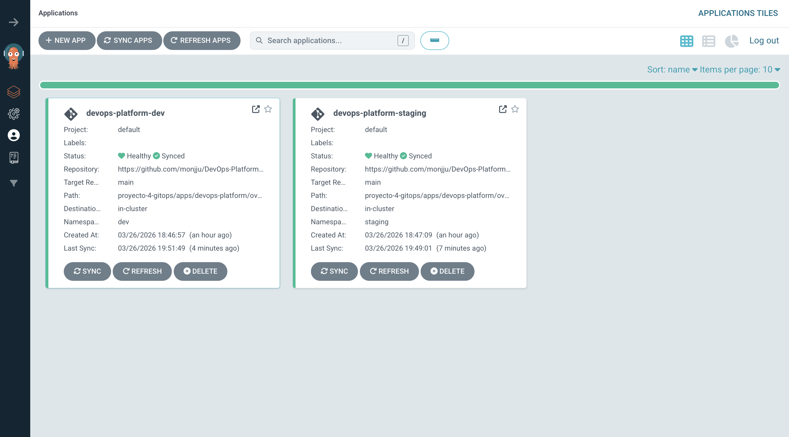
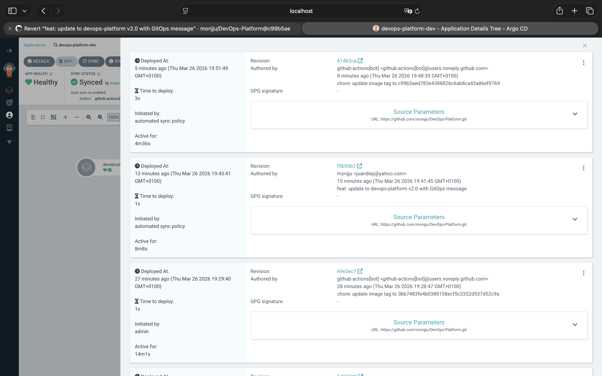
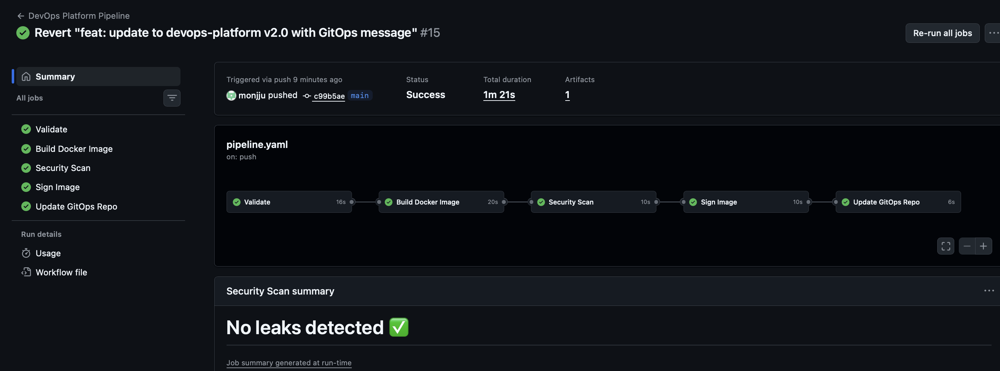

# Proyecto 4 — GitOps con ArgoCD

Cuarto proyecto del portfolio. Aquí es donde todo lo anterior se conecta.  
Forma parte del portfolio DevOps de [Juan Diego Monje](https://monjju.github.io).

## ¿Por qué este proyecto?

Después de tener Kubernetes, CI/CD e infraestructura con Terraform, me faltaba cerrar el ciclo — ¿cómo llega el código al cluster de forma automática y segura? La respuesta es GitOps.

La idea es simple: Git es la única fuente de verdad. Si no está en Git, no existe en el cluster.

## Cómo funciona
```
Hago un push a GitHub
    ↓
GitHub Actions construye, testea y firma la imagen
    ↓
El pipeline actualiza el tag de imagen en Git automáticamente
    ↓
ArgoCD detecta el cambio y sincroniza el cluster solo
    ↓
Nueva versión desplegada — sin tocar kubectl
```

Lo más interesante: el rollback es un `git revert`. Nada más.

## Arquitectura
```
DevOps-Platform (GitHub)
├── .github/workflows/pipeline.yaml  → CI/CD con deploy stage
└── proyecto-4-gitops/
    ├── apps/devops-platform/
    │   ├── base/                    → YAMLs comunes a todos los entornos
    │   └── overlays/
    │       ├── dev/                 → 1 réplica, imagen latest
    │       └── staging/             → 2 réplicas, imagen stable
    └── argocd/applications/
        ├── dev.yaml                 → le dice a ArgoCD qué vigilar en dev
        └── staging.yaml             → lo mismo para staging
```

## Stack

| Herramienta | Uso |
|-------------|-----|
| ArgoCD | Operador GitOps — vigila Git y sincroniza el cluster |
| Kustomize | Gestión multi-entorno sin duplicar YAMLs |
| Helm | Para instalar ArgoCD en el cluster |
| GitHub Actions | CI/CD + stage de deploy que actualiza Git |
| k3d | Cluster Kubernetes local |

## Decisiones que tomé y por qué

- **`selfHeal: true`** — si alguien hace un cambio manual en el cluster, ArgoCD lo revierte. Git siempre gana
- **`prune: true`** — si borro un recurso de Git, desaparece del cluster. Sin recursos huérfanos
- **Kustomize overlays** — mismo YAML base para dev y staging. Solo cambio lo que es diferente (réplicas, tag)
- **github-actions[bot] actualiza el tag** — nadie toca el cluster a mano. Todo pasa por Git

## Evidencia — GitOps en acción

### Las dos apps corriendo en ArgoCD


### Historial de deploys y rollback


### Pipeline completo en verde


## Cómo ejecutarlo
```bash
# 1. Crear cluster
k3d cluster create gitops-platform \
  --port "8080:80@loadbalancer" \
  --agents 2

# 2. Instalar ArgoCD
helm repo add argo https://argoproj.github.io/argo-helm
helm install argocd argo/argo-cd --namespace argocd --create-namespace

# 3. Acceder a la UI
kubectl port-forward svc/argocd-server -n argocd 9090:443
# https://localhost:9090 — usuario: admin

# 4. Desplegar Applications
kubectl apply -f argocd/applications/

# 5. Verificar
kubectl get applications -n argocd
```

## Lo que aprendí

Esto fue el proyecto más satisfactorio hasta ahora. Ver cómo un `git push` desencadena todo el flujo — build, scan, firma, actualización del tag, sync en ArgoCD — sin intervención manual, es exactamente lo que hace una empresa real.

También aprendí que GitOps no es solo una herramienta, es una forma de pensar. El cluster es un reflejo de Git, no al revés.

Y el rollback... hacer un `git revert` y ver cómo ArgoCD vuelve al estado anterior en segundos es algo que no olvidaré.

## Autor

**Juan Diego Monje** — Junior DevOps Engineer  
[GitHub](https://github.com/monjju) · [LinkedIn](https://linkedin.com/in/juan-monje-pulecio) · [Portfolio](https://monjju.github.io)
