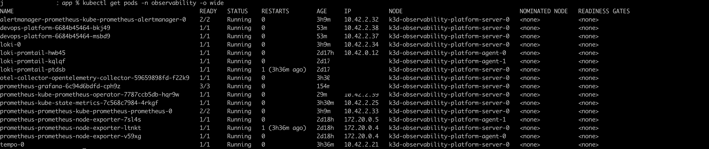
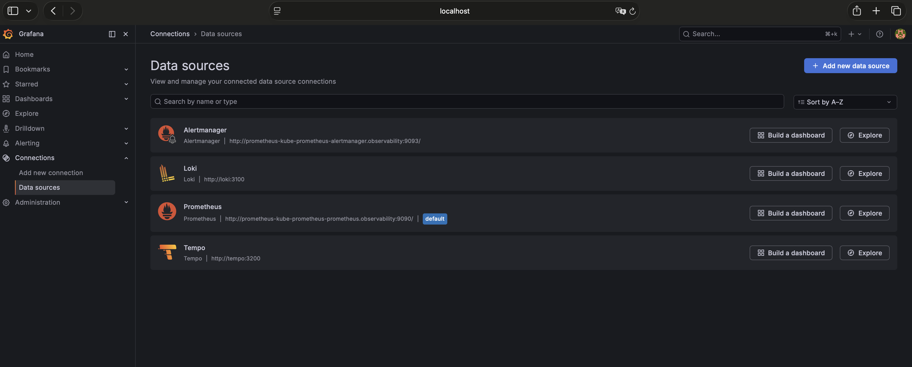
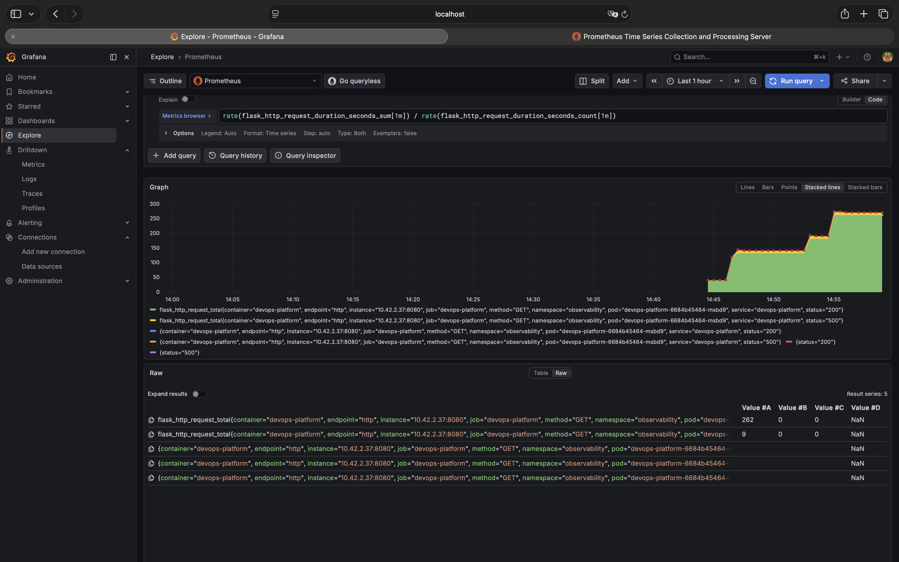
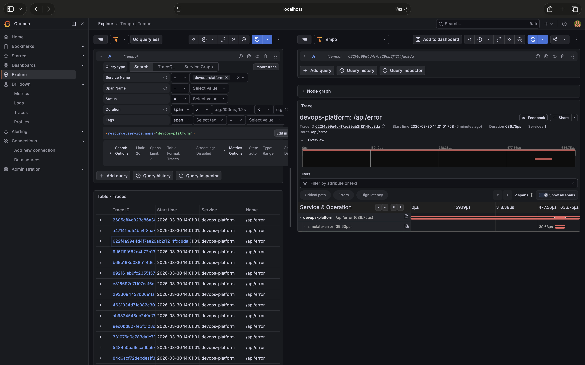
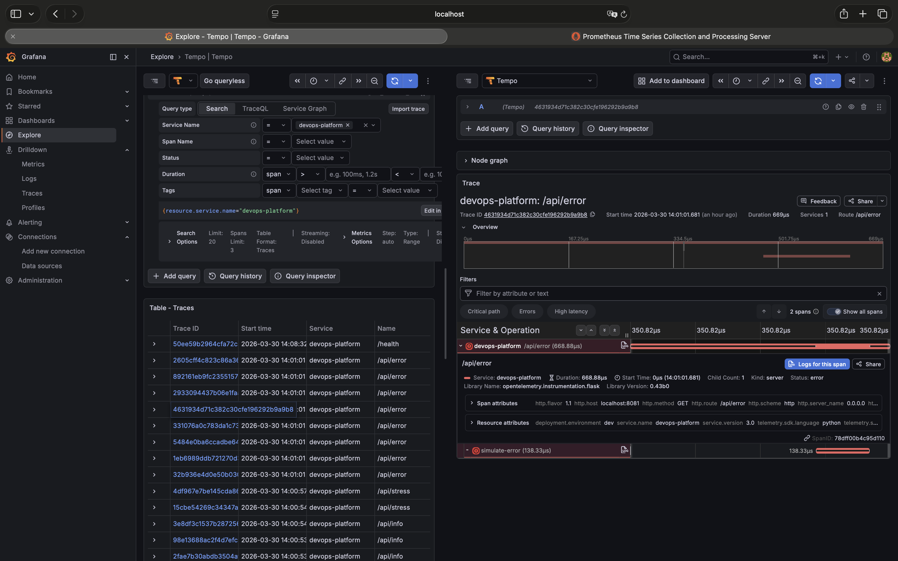
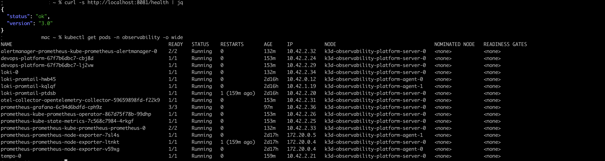

# Proyecto 5 — Observabilidad con OpenTelemetry

El proyecto que cierra el ciclo. Después de desplegar en Kubernetes, automatizar con CI/CD, provisionar con Terraform y gestionar con GitOps — la pregunta era: ¿cómo sabes que todo funciona?

Forma parte del portfolio DevOps de [Juan Diego Monje](https://monjju.github.io).

---

## ¿Por qué este proyecto?

Puedes tener el mejor pipeline del mundo. Si algo falla en producción y tardas horas en encontrar dónde, el pipeline no sirve de nada.

Este proyecto resuelve eso. Los 3 pilares de la observabilidad — métricas, logs y trazas — correlacionados por `trace_id`. Cuando algo falla, sabes exactamente dónde y cuándo en minutos.

---

## Arquitectura
```
App Flask (OTel SDK)
    ↓ trazas gRPC:4317
OTel Collector
    ↓              ↓
  Tempo        Prometheus
(trazas)       (métricas)
    ↓              ↓
         Grafana
    ↑
  Loki (logs via Promtail)
    ↑
  App stdout
```

**Flujo real:**
1. La app genera un `trace_id` por cada petición
2. Las trazas van al OTel Collector → Tempo
3. Prometheus hace scrape de `/metrics` cada 15s
4. Los logs llevan el `trace_id` embebido → Loki
5. En Grafana puedes saltar de una traza a sus logs con un clic

---

## Stack

| Herramienta | Versión | Para qué |
|-------------|---------|----------|
| kube-prometheus-stack | 82.15.0 | Prometheus + Grafana + Alertmanager |
| Loki Stack | 2.10.3 | Logs centralizados |
| Tempo | 1.24.4 | Trazas distribuidas |
| OTel Collector | 0.147.1 | Pipeline centralizado de telemetría |
| OpenTelemetry SDK | 1.22.0 | Instrumentación de la app |
| Flask | 3.0 | App instrumentada |
| k3d | local | Cluster Kubernetes |

---

## La app — 4 endpoints instrumentados
```python
/health      → healthcheck básico
/api/info    → info del sistema con span manual
/api/stress  → latencia variable (0.1-0.5s) para ver en trazas
/api/error   → simula errores 500 para probar alertas y SLOs
```

Cada endpoint genera automáticamente:
- Un span con atributos del contexto
- Métricas de latencia y contador de requests
- Logs estructurados con el `trace_id`

---

## Decisiones técnicas

**¿Por qué OpenTelemetry?**
Vendor-neutral. La app no sabe si las trazas van a Tempo, Jaeger o Datadog — eso lo decide el OTel Collector. Cambiar de backend no requiere tocar el código.

**¿Por qué Loki y no ElasticSearch?**
Loki solo indexa labels, no el contenido completo. Es 10x más barato en recursos y se integra nativamente con Grafana. Para este stack es la decisión correcta.

**¿Por qué OTel Collector como hub central?**
Desacopla la app de los backends. La app habla con el Collector — el Collector decide adónde va cada señal. Escala sin tocar el código de la app.

**ServiceMonitor para Prometheus**
Pull-based: Prometheus encuentra los servicios a scrapear mediante labels, no configuración manual. Si el servicio cae, Prometheus lo detecta automáticamente.

---

## Lo que aprendí

- La correlación entre señales es el verdadero valor — ver métricas + logs + trazas juntos cambia cómo diagnosticas problemas
- `ServiceMonitors` requieren labels exactos — el puerto debe tener nombre `http` o Prometheus no lo scrapea
- El health check de Loki falla con Grafana 12.4.2 por incompatibilidad de versiones — pero las queries funcionan. A veces el error no es donde parece
- Instrumentar con OTel es barato — unas pocas líneas en la app generan trazas completas automáticamente

---

## Cómo ejecutarlo
```bash
# 1. Crear cluster
k3d cluster create observability-platform \
  --agents 2 \
  --port "8090:80@loadbalancer"

kubectl create namespace observability

# 2. Instalar stack
helm install prometheus prometheus-community/kube-prometheus-stack \
  --namespace observability \
  --set prometheus.prometheusSpec.retention=7d

helm install tempo grafana/tempo \
  --namespace observability \
  -f tempo/values.yaml

helm install loki grafana/loki-stack \
  --namespace observability \
  --set loki.persistence.enabled=false

helm install otel-collector open-telemetry/opentelemetry-collector \
  --namespace observability \
  -f otel-collector/values.yaml

# 3. Desplegar app
docker build -t devops-platform:v3.1 app/
k3d image import devops-platform:v3.1 -c observability-platform
kubectl apply -f k8s/

# 4. Port-forwards
kubectl port-forward -n observability svc/prometheus-grafana 3000:80 &
kubectl port-forward -n observability svc/devops-platform 8081:80 &

# 5. Generar tráfico
for i in {1..50}; do curl -s http://localhost:8081/api/info > /dev/null; done
for i in {1..20}; do curl -s http://localhost:8081/api/error > /dev/null; done
```

Grafana → http://localhost:3000

---

## Nota honesta

El health check de Loki falla en Grafana por incompatibilidad entre versiones — pero las queries LogQL funcionan perfectamente. En producción real usaría versiones pinadas y testeadas juntas. Aquí lo documento porque los problemas reales también son parte del aprendizaje.

---

## Autor

**Juan Diego Monje** — Junior DevOps Engineer  
[GitHub](https://github.com/monjju) · [LinkedIn](https://linkedin.com/in/juan-monje-pulecio) · [Portfolio](https://monjju.github.io)

---

## Screenshots

### Stack completo — todos los pods Running


### 4 Datasources configurados en Grafana


### Métricas en tiempo real — Prometheus


### Logs centralizados — Loki


### Trazas distribuidas — Tempo


### Health check de la app

